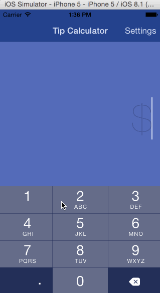
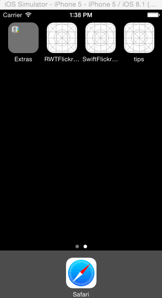

# tips
Tip calculator in Swift for [codepath](http://codepath.com) application.

## Installation

Nothing special -- clone and run in Xcode. I'd recommend running on an iPhone 5, as I didn't use autolayout and this is designed for iPhone 5.

## How many hours did it take to complete.

I didn't check the submission instructions until nearly finished with the application so I didn't keep an accurate log of the amount of time it took. I believe that it was on the order of **8-12** hours.

## Which required and optional stories have you completed?

### Required

+ The base tip calculator is complete -- it calculates the tip and total from a bill amount and selected tip percentage.
+ The settings page is implemented as a modal transition and allows different tip percentages to be selected as default. This is implemented in a UITableView, where the selected cell (.Checkmark) is the default.

NOTE: With the settings page implemented as a modal, I have been unable to get the status bar to assume the same tint color as the navigation bar. Things work as intended when implemented as a Push transition.

### Optional/Extra

+ **Design:** I attempted to replicate [this](https://camo.githubusercontent.com/732f7208c155d7441ee72173ba41981672c1950d/687474703a2f2f692e696d6775722e636f6d2f3852613864346a2e676966) design and made a few tweaks. The settings page is similarly styled.
+ **Color Scheme:** I played around with creating a color scheme via UIAppearance, Interface Builder, and various points in the code. I'm not entirely happy with the number of different entry-points there are for styling the application -- it seems rather messy. I'd love to know if there's a better way.
+ **Split:** The number of people to split the bill with is configurable with a incremental +/- segmented control.
+ **Settings:** The settings page has been extended to allow addition of new tip percentages, and removal of existing tip percentages (slide left). For UI purposes I've enforced that there be at least one and a maximum of four tip percentage options. These constraints are enforced with UIAlerts on unacceptable behavior. 
+ **Persistence:** The bill amount and and number of shares are persisted for ten minutes, at which point they reset to blank/1 respectively. The default tip amounts and tip percentages are persisted indefinitely.

## GIF Walkthroughs

### Basic

+ Animations & Color Scheme
+ Basic tip calculator functionality (tip/total calculations)
+ Split calculations
+ Modal settings page (plus annoying statusbar color issue)
+ Change default tip percentage on settings

### Extended

+ Persistence -- without a ten minute long gif you'll have to take my word for it on the fields that expire
+ Deletion of tip percentages
+ Creation of new tip percentages
